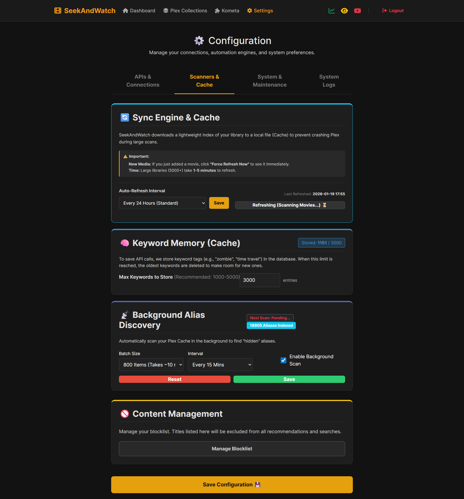
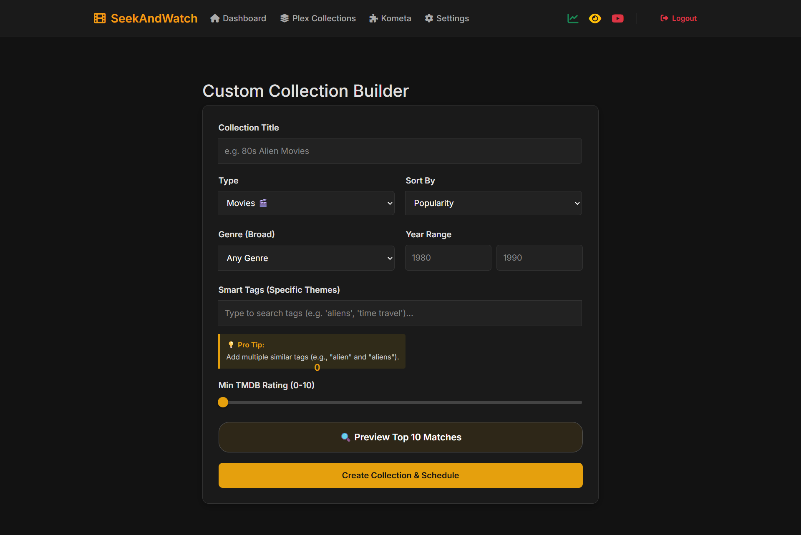

# 🚀 SeekAndWatch
   (coming soon) 

⭐ **If this saves you from endless scrolling, a star helps a ton.**

### 👋 What is SeekAndWatch?
SeekAndWatch is a self-hosted Plex companion that turns your library into a smart, personalized "what should we watch?" hub. It connects Plex, Tautulli, TMDB, and Overseerr into one clean dashboard so you can discover, decide, and request faster.

The goal is simple: spend less time browsing, more time watching. It learns your taste from real watch history, surfaces hidden gems you already own, and gives you tools to build better collections without touching YAML.

---

### 📚 Table of Contents
- [Key Features](#-key-features)
- [Screenshots](#-screenshots)
- [Requirements](#-requirements)
- [Installation](#-installation)
  - [Unraid](#unraid-has-not-been-submitted-yet)
  - [Docker (Manual)](#docker-manual)
  - [Docker Compose](#docker-compose)
- [How to Update](#how-to-update)
- [Changelog](#changelog)

## ✨ Key Features

### 🧠 Smart Discovery (Built From Your Taste)
- Analyzes your last 5,000 plays to build a personalized taste profile.
- Seed-based recommendations to surface titles you don't own or haven't watched.
- Streaming availability + Rotten Tomatoes/critic scores (with OMDB).
- "I'm Feeling Lucky" and "Spin the Wheel" for instant decisions.
- Instant trailers inside the dashboard.

### 🧩 Kometa Config Builder (No YAML Needed)
- Visual Kometa builder for overlays and collections with simple toggles.
- Live preview for overlays, ratings, codecs, and content badges.
- Generates clean starter configs you can refine later.

### 📂 Plex Collections, Done Right
- Auto-Collections with schedules (daily/weekly/manual).
- Sync modes: strict (sync) or append-only (grow forever).
- Bulk list import from IMDb/Letterboxd/Reddit, with smart matching.
- Library browser to see what collections already exist in Plex.
- Custom builder for collections and curated presets out of the box.

### 🛠️ Library Quality Tools
- Background Alias Discovery to reduce duplicate recommendations.
- Blocklist for titles you never want to see again.
- Ignore specific Plex users in recommendation history.

### 📊 Stats & Requests in One Place
- Results based off top on server.
- Overseerr integration for one-click requests.

### 🔒 Built for Long-Running Servers
- Built-in backup/restore (including importing backups).
- One-click updates for non-Unraid installs.
- System logs + health tracking for scans and scheduled jobs.
- Security safeguards for logins, forms, and file handling.
- Multi-user accounts with admin controls.

---

## 📋 Requirements

| Service | Status | Why we need it |
| :--- | :--- | :--- |
| **Plex** | **Required** | Library access and watch history. |
| **TMDB API Key** | **Required** | Posters, plot summaries, cast, and metadata. (Free at [themoviedb.org](https://www.themoviedb.org/settings/api)) |
| **Overseerr** | Recommended | Requests for new content. |
| **Tautulli** | Recommended | Live server stats and watch history analytics. |
| **OMDB API Key** | Optional | Rotten Tomatoes / critic scores. |

---

## 🐳 Installation

### Unraid (waiting on approval)
1. Go to the **Apps** tab in Unraid.
2. Search for `SeekAndWatch`.
3. Click **Install**.

### Docker (Manual)
If you prefer manual setup, run the container and point a browser to http://<YOUR_SERVER_IP>:5000

**Note:** Replace `/path/to/config` with the path where you want to store your database and settings.

```bash
docker run -d \
  --name=seekandwatch \
  -p 5000:5000 \
  -v /path/to/seekandwatch:/config \
  -e TZ=America/New_York \
  --restart unless-stopped \
  ghcr.io/softerfish/seekandwatch:latest
```

### Docker Compose
There's a `docker-compose.yml` included. From the repo root:

```bash
docker compose up -d
```

---

## How to Update
If you're not using Unraid's App store, you can update manually or use the one click updater in the app:

```bash
# 1) Pull the latest version
docker pull ghcr.io/softerfish/seekandwatch:latest

# 2) Stop + remove the container
docker stop seekandwatch
docker rm seekandwatch

# 3) Start it again
docker run -d \
  --name=seekandwatch \
  -p 5000:5000 \
  -v /path/to/seekandwatch:/config \
  -e TZ=America/New_York \
  --restart unless-stopped \
  ghcr.io/softerfish/seekandwatch:latest
```

---

## Changelog
v1.3.2
- finished last of the security updates

<details>
  <summary><b>Past Changelog</b></summary>
v1.3.1
- fixes for GitHub CodeQL findings
- changed header icons around a bit
- removed stats.html page for Tautulli stats. This page does not seem to be needed
- added custom search range for Tautulli most popular on server
- rewrote how it works on Smart Discovery
- fixed Tatulli spacing for run_order form 4 to 2

Kometa updates added: 
library templates -> save library configurations as reusable templates
undo/redo -> track changes for undo/redo
comparison mode -> compare current config vs saved config
performance indicators -> estimate run time based on selected options

- started the Wiki https://github.com/softerfish/seekandwatch/wiki

v1.3.0
- finished one click updates for non-unraid app installs. unraid users will have to use appstore updates when the app is approved
- users can import backup files now
- many small Smart Discovery improvements not limited to, but including: parallelize TMDB recommendation fetches, cache plex history for 1 hour, and instead of pure shuffle for review, we now score items by vote average × vote count and keep shuffle as a tie‑breaker
- fixed checkmark that will remove titles from influence recommendations

v1.2.4
- I accidently broke TV requests in v1.2.3. Quick repair to get that going again
- added search by future releases
- improved search results and added a checkbox to search for obscure instead of mixing them in standard results

v1.2.3
- moving all styling into a static/style.css file. There might be some broken styling here and there
- added an ignore library to the Smart Discovery search
- removed all search filters from the I'm Feeling Lucky results page 
- in Plex Collections, you now have a live view of all collections currently existing on your Plex server
- refine searches by US content rating (G, PG, PG-13...)
- included a docker-compose.yml

v1.2.2
- added trending on tatulli server to Smart Discovery
- added no more items when Smart Discovery results end
- added block icon to results page
- started adding variables to overlays under content ratings, content, and part of media
- genre options are now checkboxes
- changed layout of filters on review and results pages
- added GitHub link and version in the header
- removed YouTube and Overseerr link in the header

v1.2.1
Increased overlays on Kometa Builder

v1.2.0
- added protections to block password guessing attacks and prevent malicious file access without slowing down your dashboard
- optimized traffic limits to ensure the app runs smoothly even if you leave SeekAndWatch open 24/7
- added permission handling (entrypoint.sh) that automatically adapts to Unraid (PUID 99) or standard Docker setups, eliminating "Permission Denied" errors
- users now stay logged in even after the server restarts or updates
- addedd an adjustable time for running daily Plex Collections
- added TV show status tags to posters in Smart Discovery 
- leading space in api keys will be removed if included in a copy+paste. " 12345" instead of "12345"
- external requests timeout changed to 10 seconds

v1.1.1
- added tooltips to Kometa fields
- added template variables for collections: limit, sort_by, collection_mode, sync_mode, include, exclude
- added several collection defaults for Movies and TV. Overlays to follow
- added a startup routine to auto clear stuck "Busy" flags in the database if the container is killed during a scan
- I'm feeling lucky will now filter owned movies
- faster collection generation

Accounts
First-User-Admin: the first user to register is now automatically granted admin privileges. Subsequent users register as standard users. When the app starts, it will ask, "are there users in the database? Yes. Are there admins? No." It will automatically crown the first user found (ID 1) as the admin. Other users can be promoted to admin in User Settings. Currently, this change gives access to User Management tab access in Settings to promote, demote, and delete accounts

Builder
- live Preview now correctly identifies movies you already own instead of listing everything as missing
- fixed the rating slider number overlapping with the label on some screens

Security fixes:
- added dynamic SECRET_KEY generation using the secrets library to prevent session hijacking and unauthorized admin access
- added safety checks to the search and blocklist screens to ensure special characters in movie titles are displayed as text instead of being interpreted as code
- added a security check to every button and form 
- the new restore function now validates file paths before extraction to prevent malicious overwrites of system files
- tightened Kometa Config security. The system blindly trusted the configuration data saved in the database. We added a verification step to ensure that loaded settings are treated strictly as text, preventing any commands from running automatically if a hacker messed with your database

v1.1.0
This release has a lot of bugfixes, changes and many tweaks to improve speed and accuracy. This is the first app I've made, so I'm learning how to improve as I go with a lot of time and research. If you have any suggestions or comments, here's the new subreddit: https://www.reddit.com/r/SeekAndWatch/

- added a basic kometa yml file generator. It's at the point of working, but you will need to make edits with variables if you check a lot of boxes for collections. I will be improving this in the coming weeks.
- improved hiding recommended content in your plex library with alternative names using a new feature that sends items from your plex cache to tmdb to find and save movie/tv aliases to your alias database
- removed community alias database. You will only have aliases for your own media
- added additional filters on review page that continue on results page
- moved blocklist to settings
- added loading screen to dashboard TV/Movies search
- added tmdb and overseerrlinks to posters as well as rottentomatos and tmdb ratings
- increased Smart Discovery scan to analyze the last 5000 history entries incase one out of several users hasn't watched for a while
- moved Plex cache, alias database, and logs to the settings page. Split settings page into APIs & Connections | Scanners & Cache | System & Maintenance | Logs
- added a notice to Smart Discovery and Plex Collections page
- removed recently added from Smart Discovery page
- last 1000 keywords used in smart discovery are cached for future use avoiding new API calls while loading "more results" or future searches to avoid excessive calls and risk banning. this is found as Keyword Memory (Cache) inside the Settings page under Scanners & Cache 
- instead of checking movies one-by-one, it downloads the tags for all 30 movies at the same time
- started to overhaul the Plex collection manager. Trending lists are now fully syncable. All other lists the user can now choose between syncing and adaptive. 
- we now scan 50 pages of tmdb lists for collection creation
- added a notice to update if available


v1.0.2
- added Login | Register for login screen to make it more clear
- many small bugfixes
- fixed ignore users history for recommendations
- added api testing in settings
</details>

This product uses the TMDB API but is not endorsed or certified by TMDB.

## 📸 Screenshots

<details>
  <summary><b>View v1.1.0 screenshots. Please note, screenshots may become outdated.</b></summary>
  <br>

| Smart Discovery | Recommendations |
| :---: | :---: |
|  |  |

| Settings & Cache | Kometa Builder |
| :---: | :---: |
|  |  |

| Plex Collections | Custom Builder |
| :---: | :---: |
|  |  |


</details>